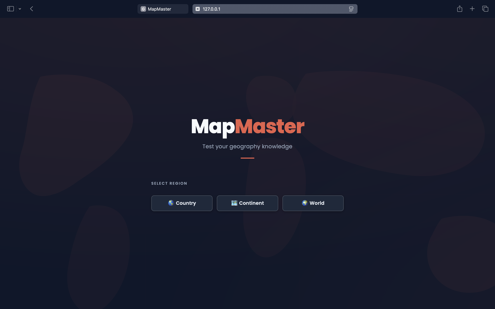
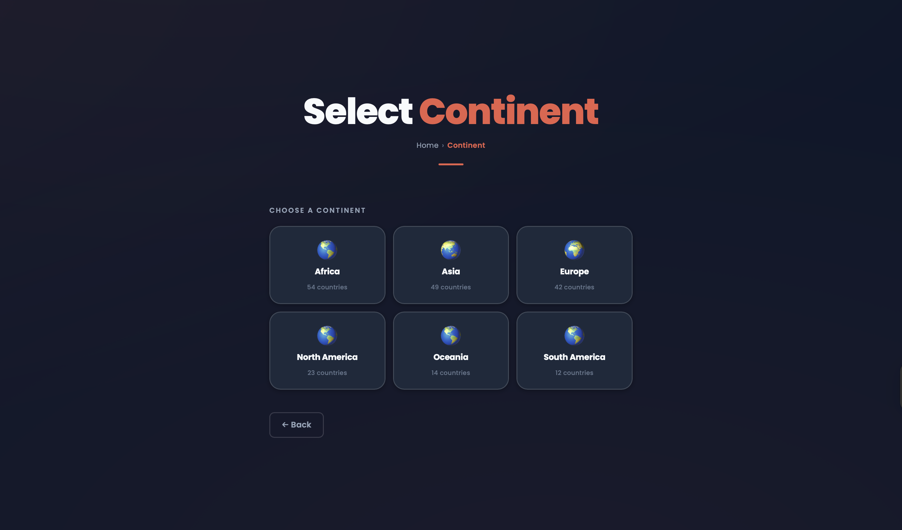
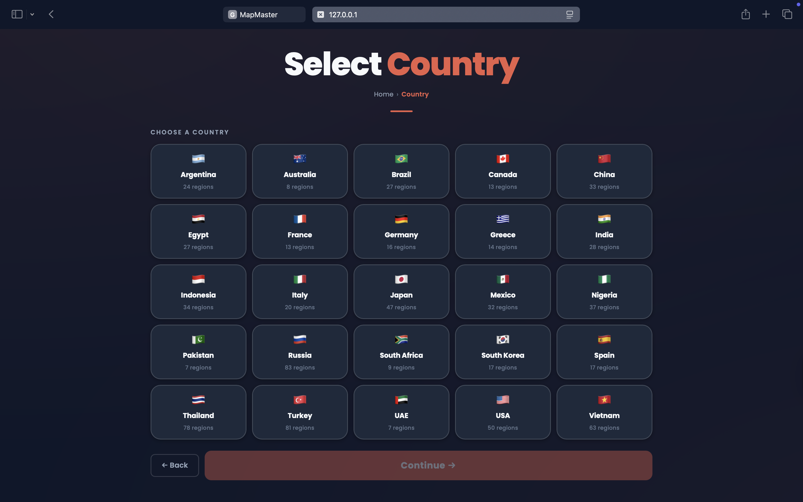
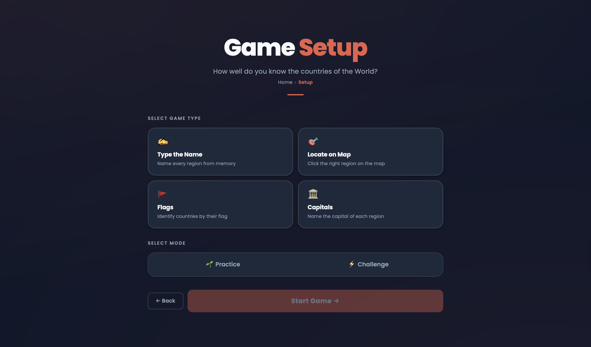
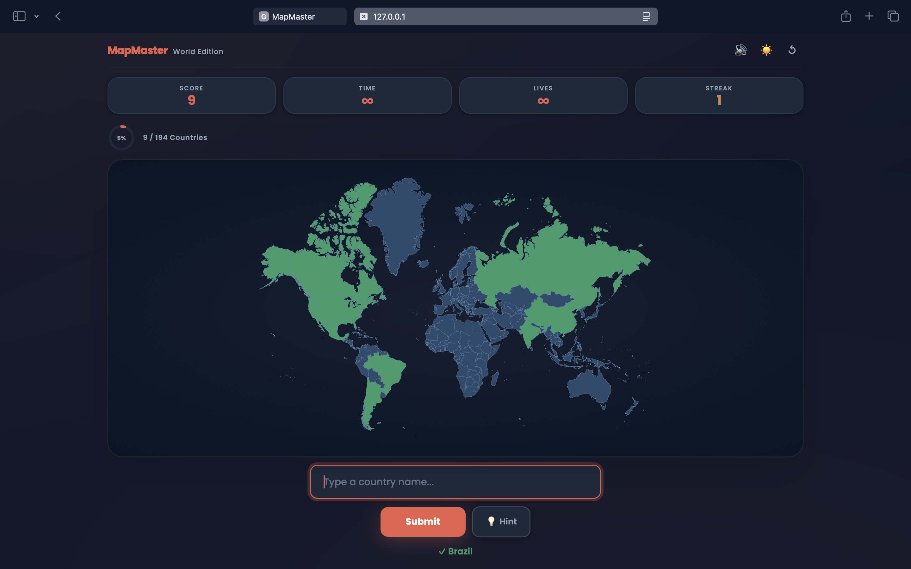
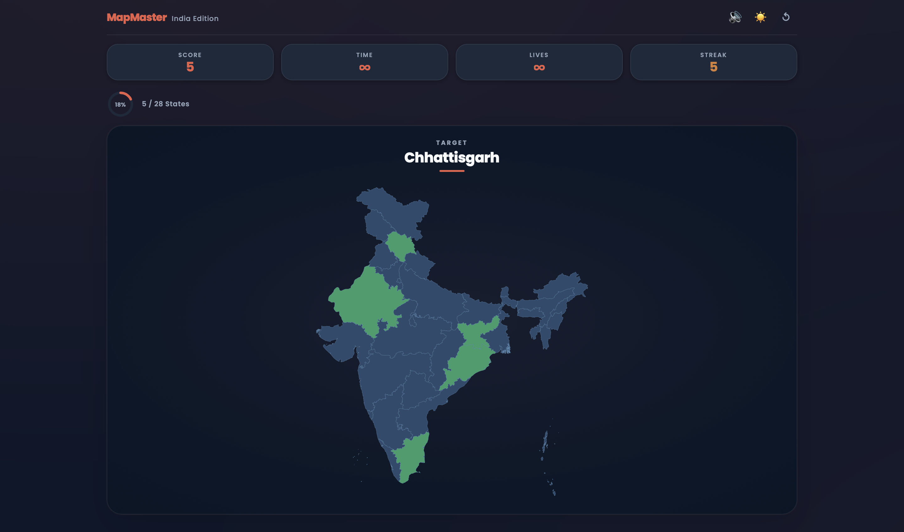
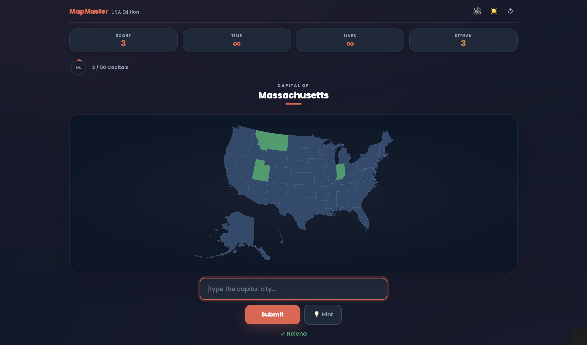
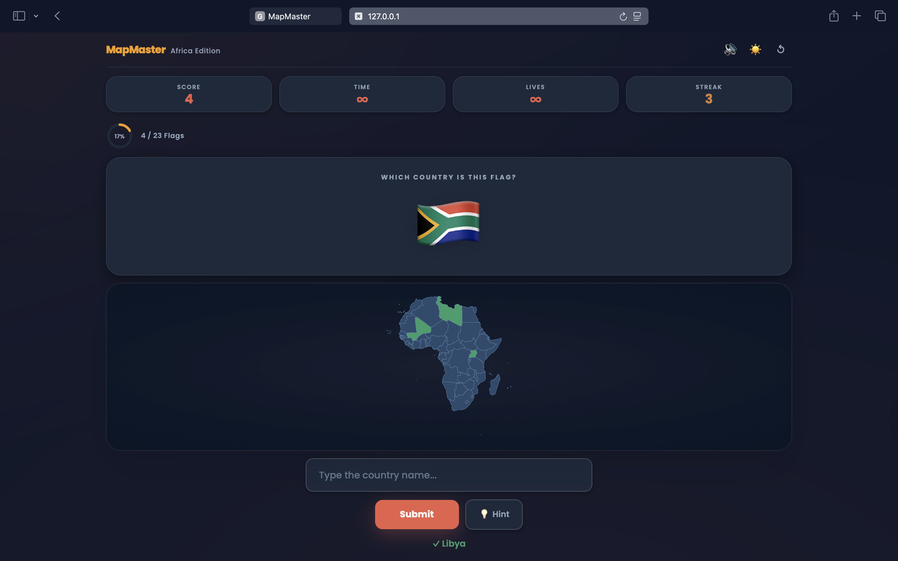

# 🗺️ MapMaster

A full-featured geography quiz web app to test your knowledge of states and countries across the world — built entirely with vanilla HTML, CSS, and JavaScript.

🌐 **[Play it live → anurag290805.github.io/mapmaster](https://anurag290805.github.io/mapmaster)**

---

## 📸 Screenshots

### 🏠 Start Screen

*Clean hero landing with scope selection — Country, Continent, or World.*

### 🌍 Select Continent

*Choose from Africa, Asia, Europe, North America, Oceania, or South America.*

### 🗺️ Select Country

*Choose from 25 countries to quiz on their states and regions.*

### ⚙️ Game Setup

*Pick one of four game types and a mode (Practice or Challenge) before starting.*

### ✍️ Type the Name — World Edition

*A target country is shown — click it on the interactive SVG map to score.*

### 🎯 Locate on Map — India Edition

*Type state names from memory to fill the map green.*

### 🏛️ Capitals Mode — United States Edition

*A region is shown — type its capital city to score.*

### 🚩 Flags Mode — Africa Edition

*A flag emoji is displayed — identify which country it belongs to.*

---

## ✨ Features

- **Four Game Types:**
  - *Type the Name* — Type every region name from memory to fill the map
  - *Locate on Map* — A target region is named; click it on the SVG map
  - *Capitals* — A region is shown; type its capital city
  - *Flags* — A flag is shown; identify which country it belongs to
- **Two Game Modes** — *Practice*: no timer, no lives, hover highlights and region tooltips visible. *Challenge*: countdown timer, limited lives, and all map hints hidden.
- **25 Countries** — Argentina, Australia, Brazil, Canada, China, Egypt, France, Germany, Greece, India, Indonesia, Italy, Japan, Mexico, Nigeria, Pakistan, Russia, South Africa, South Korea, Spain, Thailand, Turkey, UAE, USA, and Vietnam.
- **6 Continents + World** — Africa, Asia, Europe, North America, Oceania, South America, and a full 194-country World map.
- **Live SVG Maps** — Interactive SVG maps with hover highlights and tooltips (practice only), correct-answer green colouring, and wrong-click red flash animations.
- **Challenge Mode Fog** — In Challenge mode, hover highlights, tooltips, and native SVG region labels are all suppressed so the map gives nothing away.
- **Hint System** — Request a hint to reveal a clue; costs 10 seconds in Challenge mode (or 1 life in Locate).
- **Streak Tracking** — Current and best streak tracked in real time throughout each game.
- **Progress Ring** — Animated SVG ring showing completion percentage, with per-continent accent colours.
- **Accent Theming** — Each continent map applies its own colour accent across the UI (ring, header, underlines).
- **India Union Territory Easter Egg** — Type any of India's 8 Union Territories in typing mode to earn +2 bonus points each. Find all 8 to unlock the India Expert achievement toast.
- **Sound Effects** — Audio feedback on correct/incorrect answers, streaks, win, and lose, with a mute toggle.
- **Dark Mode** — Full dark theme toggle with `localStorage` persistence.
- **Confetti Win Animation** — Canvas-based confetti burst on completing a map.
- **Review Mode** — After a loss, review which regions you got right (green) and missed (red) on the map.
- **Animated Stats** — Win screen stats (time, accuracy, streak) count up with a number animation.
- **Directional Screen Transitions** — Forward navigation slides right; back navigation slides left.
- **Breadcrumb Navigation** — Country → Setup, Continent → Setup paths shown at the top of each screen.
- **Zoom & Pan** — Scroll to zoom, drag to pan on any map. Double-click to reset. Pinch-to-zoom on touch devices.
- **Responsive Design** — Works across desktop and mobile screen sizes.

---

## 🛠️ Tech Stack

| Layer | Technology |
|---|---|
| Language | HTML5, CSS3, Vanilla JavaScript (ES6+) |
| Maps | Inline SVG files per region |
| Styling | Custom CSS with CSS variables, Poppins font |
| Storage | `localStorage` for theme preference |
| Audio | Web Audio API + inline base64 WAV |
| Animation | CSS keyframes + Canvas API (confetti) |

No frameworks, no build tools, no dependencies. Open `index.html` and it runs.

---

## 🚀 Getting Started

### Play online
No setup needed — just visit **[anurag290805.github.io/mapmaster](https://anurag290805.github.io/mapmaster)** to play instantly.

### Run locally

#### 1. Clone the repository
```bash
git clone https://github.com/anurag290805/mapmaster.git
cd mapmaster
```

#### 2. Add SVG maps

Place your SVG map files in a `svg/` folder. Required files:
```
svg/india.svg          svg/usa.svg
svg/europe.svg         svg/world.svg
svg/africa.svg         svg/asia.svg
svg/oceania.svg        svg/north_america.svg
svg/south_america.svg  svg/argentina.svg
svg/australia.svg      svg/brazil.svg
svg/canada.svg         svg/china.svg
svg/egypt.svg          svg/france.svg
svg/germany.svg        svg/greece.svg
svg/indonesia.svg      svg/italy.svg
svg/japan.svg          svg/mexico.svg
svg/nigeria.svg        svg/pakistan.svg
svg/russia.svg         svg/south_africa.svg
svg/south_korea.svg    svg/spain.svg
svg/thailand.svg       svg/turkey.svg
svg/uae.svg            svg/vietnam.svg
```

Each SVG should have `<path>` elements with `aria-label`, `id`, `name`, `data-name`, or a child `<title>` tag identifying the region name. The `aria-label` attribute is the primary selector — patch your SVGs to use this for best reliability.

#### 3. Open the app
```bash
open index.html
# or just double-click index.html in your file explorer
```

No server required for most browsers. For SVG cross-origin loading, serve locally:
```bash
python3 -m http.server 8080
# then visit http://localhost:8080
```

---

## 📁 Project Structure

```
mapmaster/
│
├── index.html          # Full app markup — all screens
│
├── css/
│   ├── variables.css   # CSS custom properties, light + dark theme
│   ├── base.css        # Reset, typography, buttons, screen layout
│   ├── screens.css     # Start, setup, country/continent select, win, lose
│   ├── game.css        # Game screen, HUD, map container, prompts, input
│   └── animations.css  # All @keyframes and animation utility classes
│
├── js/
│   ├── data.js         # MAPS, FLAGS, CAPITALS, MAP_SUPPORT, INDIA_UTS
│   ├── state.js        # gameState object and shared runtime variables
│   ├── audio.js        # Sound effects via Web Audio API
│   ├── ui.js           # DOM references, HUD, screen transitions, SVG helpers
│   ├── modes.js        # Typing, Locate, Flag, and Capital mode handlers
│   ├── game.js         # Game lifecycle: reset, start, end, timer, hints
│   └── events.js       # All event listeners: navigation, input, SVG, zoom/pan
│
└── svg/
    ├── india.svg           ├── usa.svg
    ├── europe.svg          ├── world.svg
    ├── africa.svg          ├── asia.svg
    ├── oceania.svg         ├── north_america.svg
    ├── south_america.svg   ├── argentina.svg
    ├── australia.svg       ├── brazil.svg
    ├── canada.svg          ├── china.svg
    ├── egypt.svg           ├── france.svg
    ├── germany.svg         ├── greece.svg
    ├── indonesia.svg       ├── italy.svg
    ├── japan.svg           ├── mexico.svg
    ├── nigeria.svg         ├── pakistan.svg
    ├── russia.svg          ├── south_africa.svg
    ├── south_korea.svg     ├── spain.svg
    ├── thailand.svg        ├── turkey.svg
    ├── uae.svg             └── vietnam.svg
```

---

## 🧠 Key Technical Highlights

**Modular JS architecture** — The codebase is split into 7 responsibility-based modules (`data`, `state`, `audio`, `ui`, `modes`, `game`, `events`). Adding a new country only requires changes to `data.js` and one button in `index.html`.

**Dynamic SVG interaction** — SVG maps are loaded via `<object>` tags and manipulated through `contentDocument`. Paths are queried primarily by `aria-label`, with fallbacks to `id`, `data-name`, `name`, and child `<title>` elements to support a wide variety of SVG formats.

**Challenge mode fog** — In Challenge mode, SVG `<title>` elements are stripped from the DOM at load time (preventing native browser tooltips), and the JS hover highlight and custom tooltip are both gated behind a `gameState.gameMode === "practice"` check — so the map gives nothing away.

**Auto-fit viewBox** — On SVG load, the script computes the real bounding box across all `<path>` elements and sets a tight `viewBox`, ensuring maps with offset coordinates display correctly and fill the container.

**Accent colour theming** — Each continent map sets `--accent` and `--accent-glow` CSS variables on `:root`, instantly recolouring the progress ring, header logo, underlines, and map glow without any additional class toggling.

**Progress ring** — An SVG `<circle>` with `stroke-dashoffset` drives the progress indicator, animated with a CSS transition. The ring replaces the old bar at the top of the game screen for a cleaner, more compact HUD.

**Multi-scope map engine** — A single `MAPS` data object drives all map contexts. `applyMap()` swaps the SVG source, region list, accent colour, and all UI labels in one call.

**India UT easter egg** — Union Territories are tracked in a separate `guessedUTs` array outside the main game loop, so they can award bonus points without interfering with win condition checks or the guessed regions list.

**Confetti engine** — A pure Canvas API particle system with random colours, spin, velocity, and a fade-out over 5 seconds — no external libraries.

**Directional screen transitions** — `showScreen()` accepts a direction parameter (`"forward"` / `"back"`) and applies the appropriate slide animation pair, giving the navigation a native app-like feel.

---

## 📋 What I Learned

- Manipulating embedded SVG documents via `contentDocument` across different SVG formats and browsers
- Building a multi-screen single-page app with pure JavaScript state management
- Computing dynamic SVG `viewBox` values from path bounding boxes for universal map support
- Implementing four distinct game mechanics within a single unified game loop
- Designing a modular, data-driven architecture that scales cleanly to new maps and regions
- Suppressing native browser SVG tooltips and controlling all hover behaviour programmatically

---

## 👤 Author

**Anurag Srivastava**  
[GitHub](https://github.com/anurag290805)

---

## 📄 License

This project is licensed under the [MIT License](LICENSE).
